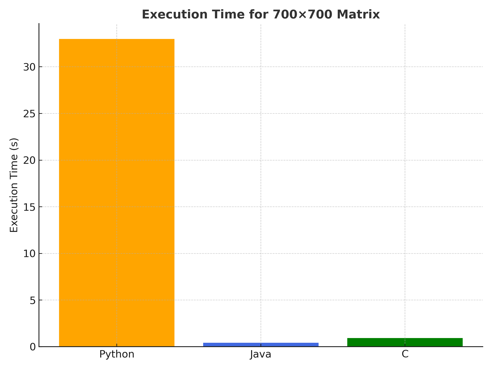

# Big Data Assignment 1: Matrix Multiplication

This project compares the performance of matrix multiplication implemented in **Python**, **Java**, and **C**.  
It was developed as part of the *Big Data* course in the **Grado en Ciencia e Ingeniería de Datos** at the **Universidad de Las Palmas de Gran Canaria (ULPGC)**.

---

##  Objective

The aim of this assignment is to analyze how execution time scales with matrix size across different programming languages.  
The same algorithm — the basic **O(n³)** matrix multiplication — was implemented in Python, Java, and C to measure:

- Execution time  
- Memory efficiency (conceptually discussed)  
- CPU utilization (qualitatively observed)  

---

##  Methodology

Each program multiplies two randomly generated **n×n** matrices filled with floating-point numbers between 0 and 1.  
The following matrix sizes were tested:

**10, 25, 50, 100, 200, 300, 400, 500, and 700.**

Each experiment was executed **7 times** per matrix size, and the **average execution time** was recorded to reduce fluctuations caused by system processes.

Results were stored in CSV files and later visualized through Python plots.

---

##  Project Structure

BigData_Assignment1/
├── code/
│ ├── python/
│ ├── java/
│ └── c/
├── BigData_Assignment1.pdf # Final report (LaTeX compiled)
├── Matrix_Multiplication_Report.tex # LaTeX source file
├── execution_time_bar.png # Bar chart (700×700)
├── execution_time_linear.png # Linear comparison chart
├── execution_time_log.png # Logarithmic scale chart
└── README.md

---

##  Results Overview

| Matrix Size (n×n) | Python (s) | Java (s) | C (s) |
|--------------------|-------------|-----------|-------|
| 10  | 0.000000 | 0.000026 | 0.000005 |
| 25  | 0.000000 | 0.000223 | 0.000041 |
| 50  | 0.009100 | 0.000245 | 0.000329 |
| 100 | 0.061600 | 0.000806 | 0.002599 |
| 200 | 0.487600 | 0.005167 | 0.021321 |
| 300 | 1.731800 | 0.024897 | 0.072499 |
| 400 | 4.212100 | 0.067373 | 0.173197 |
| 500 | 8.929700 | 0.142549 | 0.347377 |
| 700 | 32.975600 | 0.411627 | 0.927541 |

---

##  Graphical Analysis

The following graphs summarize the performance results:

- **Execution Time vs Matrix Size (Linear Scale)**  
  

- **Execution Time vs Matrix Size (Log Scale)**  
  

- **Execution Time for 700×700 Matrix (Bar Chart)**  
  

These visualizations clearly show that:
- **C** consistently outperforms Java and Python.
- **Java** offers balanced scalability due to JIT optimization.
- **Python** exhibits the slowest performance due to its interpreted nature.

---

##  Discussion

From the results, it is clear that language design strongly affects performance:

- **C** was the fastest overall, thanks to direct memory management and compilation to native machine code.  
- **Java** achieved mid-level performance, benefiting from JIT compilation and automatic memory management.  
- **Python** was the slowest, as its interpreter adds significant overhead to arithmetic operations.

The logarithmic plot highlights how execution time grows exponentially with matrix size, especially for Python.

---

##  Conclusion

This benchmarking study demonstrates that **compiled languages (C, Java)** outperform **interpreted ones (Python)** in computationally intensive tasks.  

- **C** offers the best performance and efficiency.  
- **Java** balances speed and portability.  
- **Python** remains ideal for prototyping and smaller-scale analyses.  

Overall, language choice depends on context:
- For performance-critical systems → use **C** or **Java**.  
- For rapid development or data exploration → use **Python**.

---

##  Author

**Andrea Dumpierrez Medina**  
*Grado en Ciencia e Ingeniería de Datos — ULPGC*  
[GitHub Repository](https://github.com/Andrea-Dumpierrez/BigData_Assignment1)
